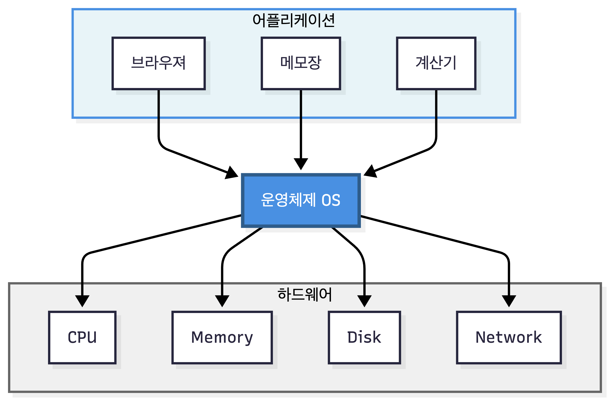
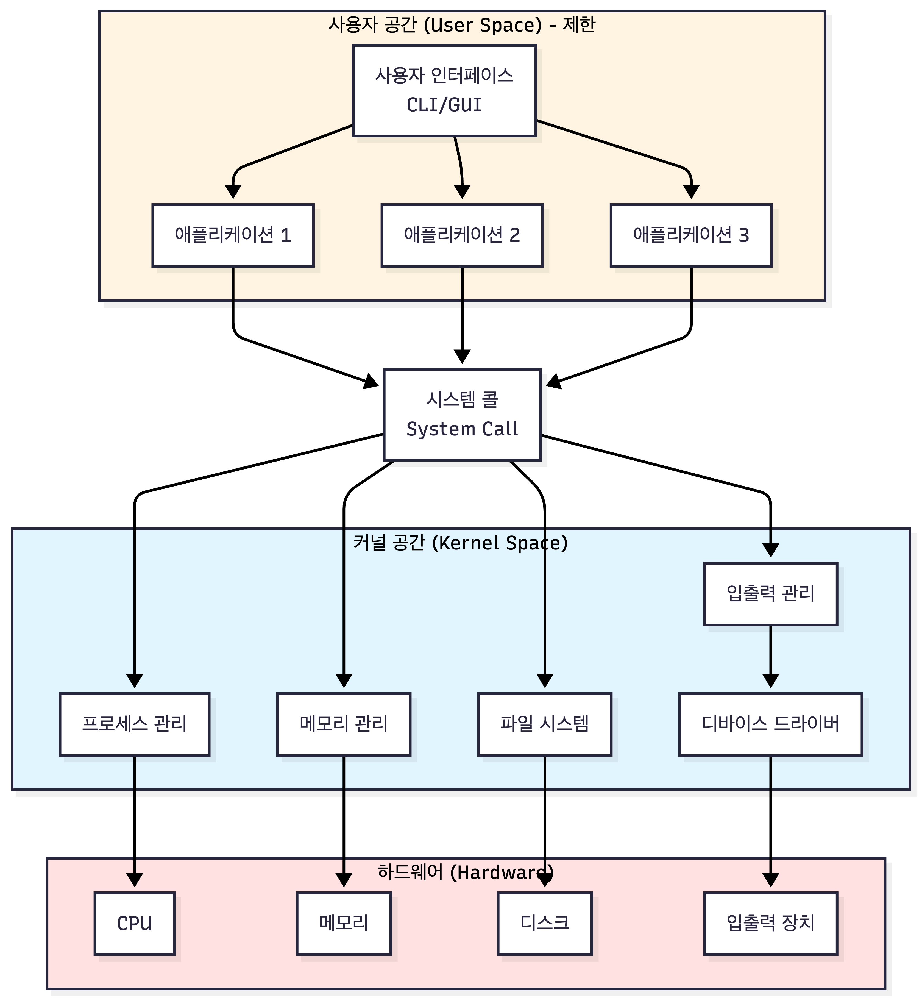

운영체제(Operating System, OS)는 **컴퓨터 하드웨어와 사용자 애플리케이션 사이에서 중재자 역할을 수행하는 시스템 소프트웨어**다. 하드웨어 자원을 효율적으로 관리하고, 사용자와 애플리케이션이 컴퓨터를 편리하게 사용할 수 있는 환경을 제공한다.

운영체제가 없다면 개발자는 모든 하드웨어를 직접 제어해야 한다. 메모리 할당, CPU 스케줄링, 디스크 접근 등을 모두 수동으로 관리해야 하며, 이는 매우 복잡하고 비효율적이다. 운영체제는 이러한 복잡성을 추상화하여 개발자가 비즈니스 로직에 집중할 수 있게 해준다.

## 운영체제의 주요 역할

운영체제는 CPU, 메모리, 디스크, 네트워크 등 **제한된 하드웨어 자원을** 여러 프로세스가 공정하게 사용할 수 있도록 **자원 관리** 역할을 수행한다.

파일 시스템은 디스크의 물리적 구조를 숨기고 파일과 폴더라는 개념으로 제공하고, 프로세스는 메모리의 물리적 주소를 알 필요 없이 가상 주소 공간을 사용하는 등 **복잡한 하드웨어를 간단한 인터페이스로 추상화한다**.

한 프로세스가 다른 프로세스의 메모리에 접근하지 못하도록 막고, 중요한 시스템 자원에 대한 **사용자 권한을 관리**하여 허가되지 않은 작업을 방지한다.

CLI(Command Line Interface)나 GUI(Graphical User Interface)를 통해 파일을 관리하고 프로그램을 실행할 수 있도록 **사용자 인터페이스**를 제공하여 사용자가 컴퓨터와 상호작용할 수 있게 한다.

## 운영체제의 구조

운영체제는 크게 **커널**(Kernel)과 **사용자 공간**(User Space)으로 나뉜다.

**커널**은 운영체제의 핵심으로, 하드웨어와 직접 상호작용하는 부분이다. 프로세스 관리, 메모리 관리, 파일 시스템, 디바이스 드라이버 등이 커널에 포함된다. 커널은 시스템의 가장 낮은 레벨에서 동작하며, 특권 모드(Privileged Mode)에서 실행되어 모든 하드웨어에 접근할 수 있다.

**사용자 공간**은 일반 애플리케이션이 실행되는 영역이다. 사용자 프로그램은 제한된 권한으로 실행되며, 하드웨어에 직접 접근할 수 없다. 하드웨어 자원이 필요할 때는 시스템 콜(System Call)을 통해 커널에 요청한다.

**시스템 콜**은 사용자 모드와 커널 모드를 전환하는 인터페이스다. 애플리케이션이 `open()`, `read()`, `write()` 같은 라이브러리 함수를 호출하면, 내부적으로 시스템 콜이 발생하여 커널 모드로 전환된다. 커널이 작업을 완료하면 다시 사용자 모드로 돌아와 결과를 반환한다.

이러한 분리는 사용자 프로그램의 오류가 전체 시스템을 영향을 주지않고, 악의적인 프로그램이 시스템을 손상시키는 것을 방지한다.

## 운영체제의 주요 구성 요소

- **프로세스 관리**: 프로그램의 실행을 관리한다. 프로세스 생성과 종료, CPU 스케줄링, 프로세스 간 통신(IPC)을 담당하며, 여러 프로세스가 동시에 실행되는 것처럼 보이게 하는 것도 운영체제의 역할이다.

- **메모리 관리**: 각 프로세스에 메모리를 할당하고 회수하며, 가상 메모리를 통해 물리 메모리보다 큰 주소 공간을 제공하는 등 RAM를 효율적으로 사용하도록 관리한다.

- **파일 시스템**: 디스크에 데이터를 저장하고 관리하는 방법을 제공한다. 파일과 디렉토리 구조, 접근 권한, 데이터 무결성 등을 관리한다.

- **입출력 시스템**: 키보드, 마우스, 디스크, 네트워크 카드 등 다양한 입출력 장치를 관리한다. 디바이스 드라이버를 통해 하드웨어의 차이를 추상화하고, 애플리케이션이 일관된 방식으로 장치를 사용할 수 있게 한다.

## 운영체제가 백엔드 개발자에게 중요한 이유

시스템의 확장성과 가용성을 고려할 때 운영체제의 제약사항과 특성을 이해하면 더 나은 설계를 할 수 있다. 프로세스 기반 vs 스레드 기반 아키텍처, 동기 vs 비동기 처리 등의 선택을 할때 운영체제 지식이 필요하다.

CPU 바운드 작업과 I/O 바운드 작업의 차이를 이해하면 적절한 **성능 최적화** 전략을 선택할 수 있다. 또한 여러 요청을 동시에 처리할 때 발생하는 race condition, deadlock 등의 **동시성 제어** 문제는 운영체제의 동기화 메커니즘을 이해해야 해결할 수 있으며, 메모리 누수, CPU 과부하, 파일 디스크립터 고갈 등의 문제를 진단하고 해결하려면 운영체제의 자원 관리 방식을 알아야 한다.

많은 현대 기술이 운영체제 개념을 기반으로 한다. Redis의 싱글 스레드 아키텍처, Nginx의 이벤트 기반 모델, Node.js의 이벤트 루프 등은 모두 운영체제 개념과 연결되어 있다.
