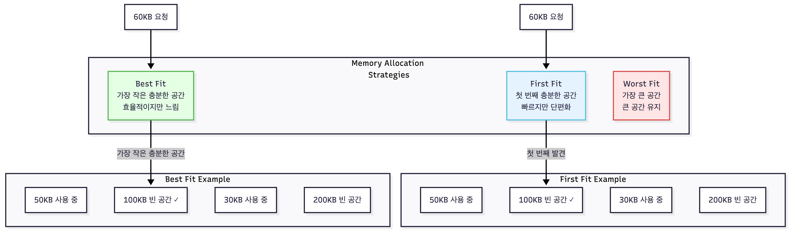

메모리는 **프로그램과 데이터를 저장하는 하드웨어 자원**이며, 컴퓨터 시스템 성능의 핵심 요소다. CPU가 아무리 빨라도 메모리에서 데이터를 가져오는 속도가 느리면 전체 성능이 저하된다. 메모리 관리는 제한된 물리 메모리를 효율적으로 사용하고, 프로세스에게 충분한 메모리를 제공하는 운영체제의 중요한 역할이다.

메모리는 단일 계층이 아니라 여러 단계로 구성되며 레지스터, 캐시, 주 메모리, 디스크 등 계층을 이루며, 속도와 용량이 트레이드오프 관계에 있다. 운영체제는 가상 메모리, 페이징, 스왑 등의 기법으로 메모리를 관리하여 프로그램이 물리 메모리 제약을 넘어서 실행될 수 있도록 한다.

## 메모리 계층 구조

메모리 계층은 **속도, 용량, 비용의 균형**을 맞추기 위해 설계되었다.

- **레지스터**(Register): CPU 내부에 있는 가장 빠른 메모리다. 접근 시간이 1 사이클 미만이며, 수십 바이트 정도의 용량을 가진다. 범용 레지스터, 프로그램 카운터, 스택 포인터 등이 여기 속한다.

- **캐시**(Cache): CPU와 주 메모리 사이의 중간 저장소다. L1, L2, L3 캐시로 나뉘며, L1이 가장 빠르고 작다. 최근 사용된 데이터를 저장하여 메모리 접근 시간을 줄인다.

- **주 메모리**(Main Memory, RAM): 프로그램과 데이터가 실행되는 공간으로 전원이 꺼지면 내용이 사라진다.

- **보조 기억장치**(Secondary Storage): 디스크(HDD, SSD)를 말한다. 접근 시간은 RAM보다 훨씬 느리다.

## 가상 메모리 (Virtual Memory)

가상 메모리는 **프로세스에게 실제보다 큰 메모리 공간을 제공하는 기술**이다. 각 프로세스는 독립적인 가상 주소 공간을 가지며, 운영체제가 가상 주소를 물리 주소로 매핑한다.

물리메모리보다 더 큰 주소 공간을 사용 가능하게 하며, 각 프로세스는 자신의 가상 주소 공간만 접근해 메모리를 보호한다. 여러 프로세스가 같은 메모리 페이지를 공유 가능하게 할수 있으며, 디스크를 확장 메모리로 사용하도록 한다.

## 메모리 할당 전략

운영체제는 프로세스에게 메모리를 할당할 때 여러 전략을 사용한다.

메모리 할당 전략은 각각 다른 특성을 가진다. **First Fit**은 첫 번째로 충분한 크기의 빈 공간을 찾아 할당한다. 할당 속도가 빠르지만, 외부 단편화가 발생할 수 있다.

**Best Fit**은 가장 작은 충분한 공간을 찾아 할당한다. 메모리를 효율적으로 사용하지만, 모든 빈 공간을 검색해야 하므로 검색 시간이 길다. 또한 작은 조각이 많이 생길 수 있다. 메모리가 제약적인 시스템에서 사용된다.

**Worst Fit**은 가장 큰 빈 공간을 찾아 할당한다. 큰 공간을 유지하려는 의도지만, 실제로는 비효율적이어서 거의 사용되지 않는다. 특수한 목적이 있을 때만 고려된다.

## 스와핑 (Swapping)

스와핑은 **메모리가 부족할 때 프로세스 일부를 디스크로 이동**시키는 기법으로 디스크의 스왑 영역(Swap Space)에 임시 저장하고, 필요할 때 다시 메모리로 로드한다.

과도한 스와핑으로 시스템 성능이 극도로 저하되는 **스래싱(Thrashing)** 문제가 있다.

## 메모리 압축 (Memory Compression)

메모리 압축은 **사용하지 않는 메모리 페이지를 압축하여 공간을 절약**하는 기법이다. 스왑보다 빠르며, 디스크 I/O를 줄인다.

## 압축 vs 스와핑 비교

메모리 압축과 스와핑은 각각 다른 특성을 가진다. **압축**은 CPU가 메모리 페이지를 압축하고 해제하므로 속도가 빠르다. 하지만 CPU 사용률이 높아진다. 공간 효율은 2-3배 정도 절약할 수 있다.

**스왑**은 디스크 I/O를 사용하므로 속도가 느리다. 하지만 CPU 사용률은 낮다. 공간 효율 측면에서는 디스크 크기만큼 무제한으로 확장할 수 있다. Linux의 swap 파티션이나 Windows의 pagefile이 이 방식을 사용한다. 압축은 빠르지만 CPU를 많이 쓰고, 스왑은 느리지만 CPU 부담이 적다.

메모리는 시스템 성능의 병목이 되기 쉬운 자원이다. 가상 메모리, 캐시, 페이징 등의 메커니즘을 이해하고, 메모리 사용을 모니터링하며, 적절한 튜닝을 통해 안정적이고 효율적인 시스템을 구축할 수 있다.
